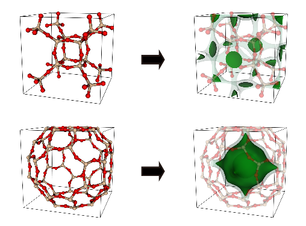

# GRIDAY

Energy shape calculator for the porous materials



## Installation of GRIDAY as Shared Library

* Dependency

```
C++14
```

* Compile shared library.

```
$ make
```

## Minimal Usage

### Generation of methane energy shape of zeolite ACO

```c++
#include <iostream>
#include <string>
#include <exception>

#include "Griday.hpp"

int
main(int argc, char* argv[])
try {
    using namespace std;

    GReal spacing = 0.02;
    string atomTypeName {"./FF/Zeolite_Type.def"};
    string forceFieldName {"./FF/Zeolite_FF.def"};
    string cssrName {"ACO.cssr"};
    string outputStem {"ACO"};

    AtomTypeMap typeMap;
    typeMap.read(atomTypeName);

    cout << "1. Atom type information" << endl;
    typeMap.print();
    cout << endl;

    ForceField forceField {typeMap};
    forceField.read(forceFieldName);

    cout << "2. Force Feild Information" << endl;
    forceField.print();
    cout << endl;

    Framework framework {typeMap};

    cout << "3. Generating Energy Grid" << endl;
    GridMaker maker {typeMap, framework, forceField};

    framework.read(cssrName);
    framework.print();
    cout << endl;

    maker.setFramework(framework);
    maker.make("CH4", spacing, outputStem);

    return 0;
    }
catch (GridayException& e)
    {
    std::cerr << e.what() << std::endl;
    }
catch (std::exception& e)
    {
    std::cerr << e.what() << std::endl;
    }
```

Compile the example code.

```bash
$ g++ example.cpp -o example.x --std=c++14 -L . -l griday -O3
```

Run the example.

```bash
$ ./example.x
```

## How to Make CSSR file

[ZEO++](http://www.zeoplusplus.org/examples.html) can convert `CIF` file to `CSSR` file.

```bash
$ network -cssr ACO.cif
```


